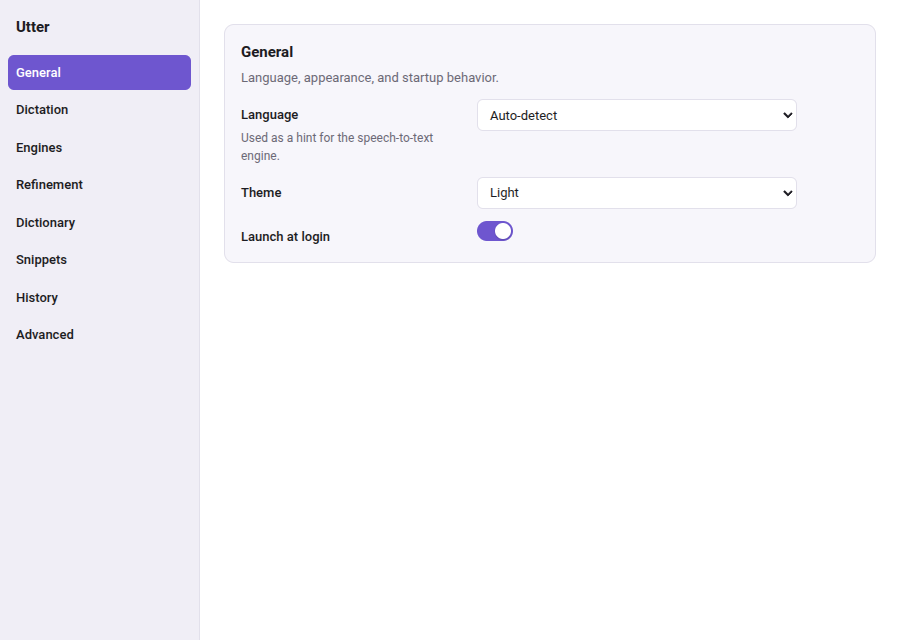
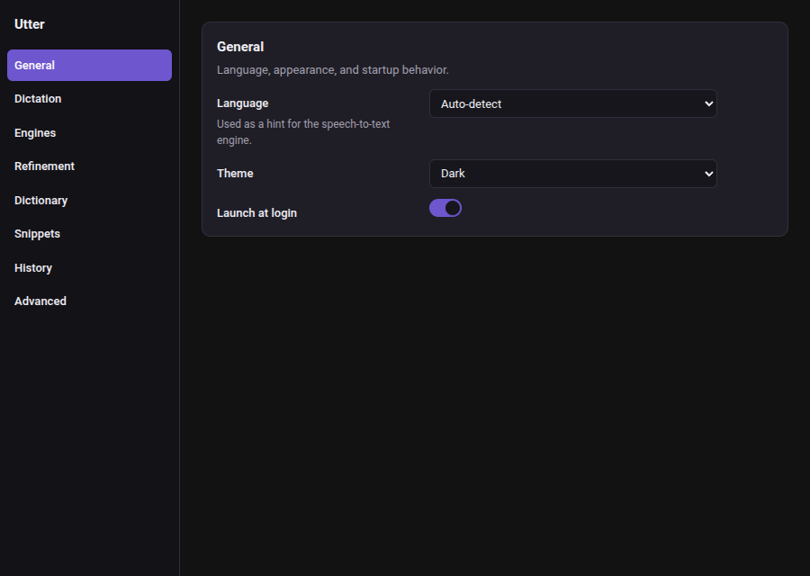
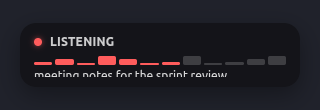
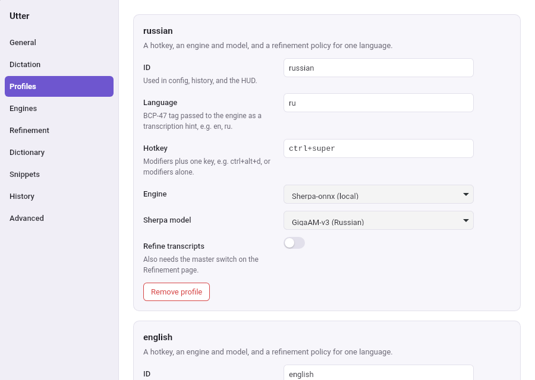
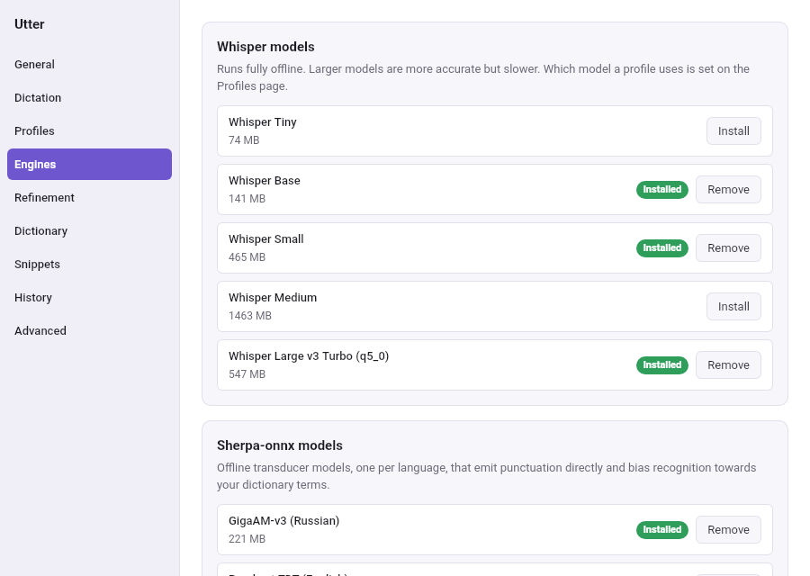
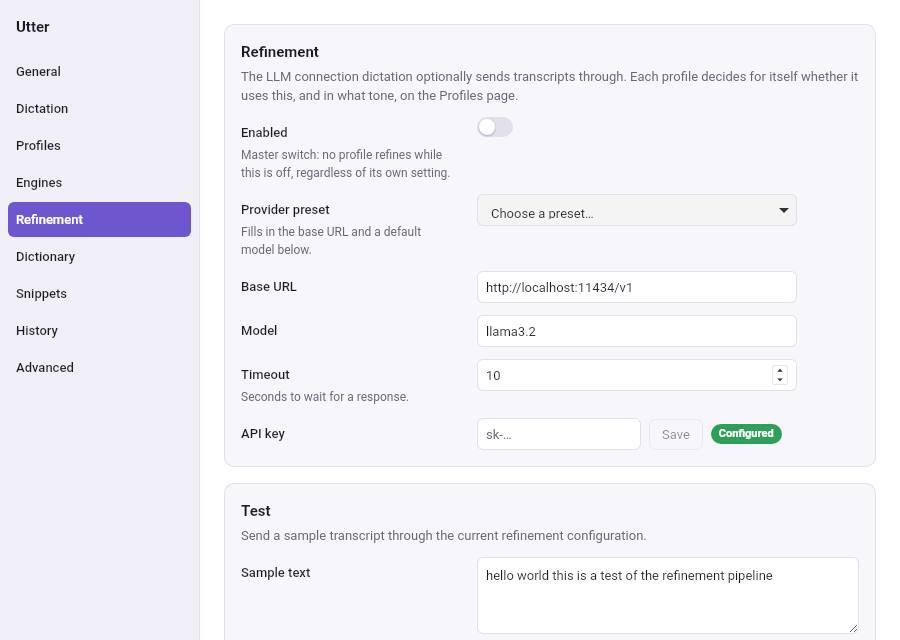
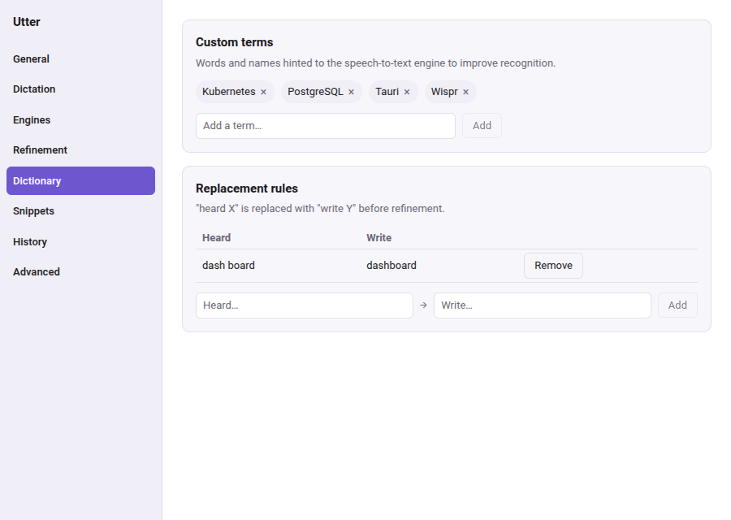
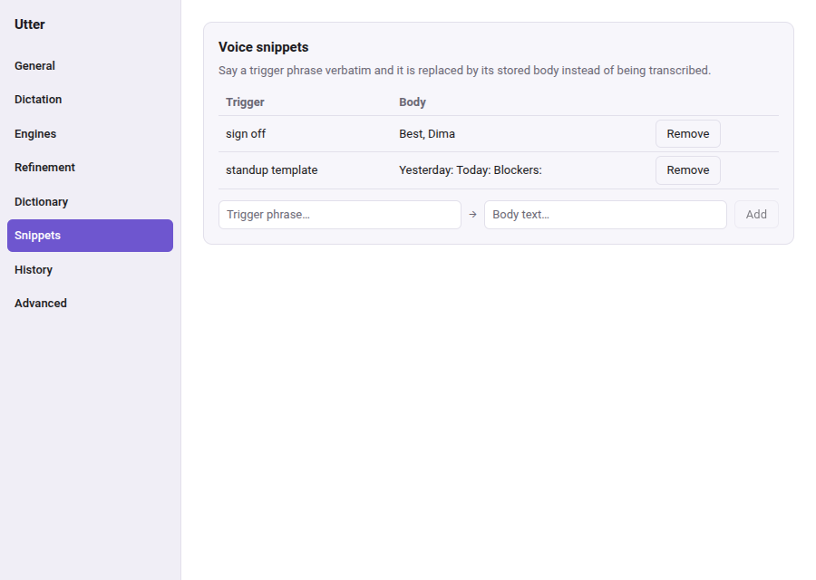
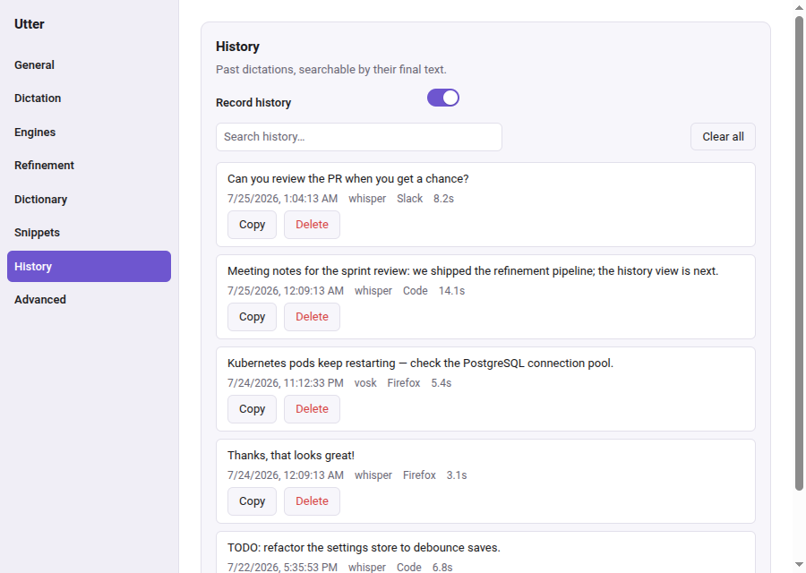

# Utter

**Utter it. It types.**

Utter is a privacy-first, Linux-first desktop dictation app. Each language
you dictate in gets its own hotkey chord — press it, speak, and clean,
formatted text lands in whatever field currently has focus — a terminal, an
editor, a chat window, anything. Speech recognition runs locally by default
(whisper.cpp or sherpa-onnx); an optional LLM pass cleans up filler words and
punctuation before the text is typed. Nothing about the pipeline is fixed:
each profile's engine, model and refinement tone, and the injection method,
are all swappable in settings.

Audio never touches disk, API keys live in the OS keyring, and the app makes
no network calls except the ones you configure yourself (a refinement
endpoint, a model download).

<p align="center">
  
  
</p>

## Features

- **Language profiles** — bind an independent hotkey chord to each language
  you dictate in, each with its own speech-to-text engine, model, and
  refinement tone; press a profile's hotkey and everything downstream
  follows from it automatically, with no separate engine switch. Engines
  load lazily, the first time a profile's hotkey is actually pressed, and a
  profile whose model is missing or damaged never disables another
  profile's hotkey.
- **Dictation session** — push-to-talk or toggle mode, a small always-on-top
  HUD showing recording/transcribing/refining state and a live input level
  meter, cancel with Escape or a hotkey tap.
- **Speech-to-text engines** — `whisper.cpp` for accurate batch transcription
  (tiny through large-v3-turbo, quantized variants included); `sherpa-onnx`
  for fast offline transcription, one transducer model per language
  (GigaAM-v3, Russian only, and Parakeet TDT 110M, English), both emitting
  punctuation and capitalization directly and both accepting personal
  dictionary terms as hotwords; or any OpenAI-compatible cloud
  `/audio/transcriptions` endpoint (BYOK).
- **AI text refinement** — optional pass over the transcript: removes filler
  words, fixes punctuation and casing, applies a tone preset (`verbatim`,
  `clean`, `formal`, `notes`, `code-comment`). Works against any
  OpenAI-compatible `/chat/completions` endpoint, including a fully local
  **Ollama** setup. If refinement fails or times out, the raw transcript is
  injected instead of losing the dictation.
- **Personal dictionary** — custom terms hinted to the engine and the
  refiner, plus literal "heard X, write Y" replacement rules applied to every
  transcript.
- **Snippets** — a spoken trigger phrase expands to a stored template,
  bypassing refinement entirely.
- **History** — a local SQLite log of past dictations (text, engine,
  duration, target app) with search and delete; disable it entirely if you
  don't want it. Audio itself is never stored, history setting or not.
- **Text injection** — clipboard-paste (fastest, default), direct typing, or
  clipboard-only as a universal fallback, tried in order until one works.
  Direct typing synthesizes individual key presses and so covers only what a
  US-QWERTY layout can reach; anything else (Cyrillic, CJK, emoji) falls
  through to clipboard-paste rather than being dropped.
- **Tray and settings UI** — a quick refinement on/off toggle, a full
  settings window (profiles, engines, refinement, dictionary, snippets,
  history), and a first-run onboarding flow that walks through mic check,
  model download, hotkey choice, and permissions.

## Screenshots

<p align="center">
  
</p>

The HUD floats above whatever window has focus while dictating, showing the
current phase (listening, transcribing, refining, injecting), a live input
level meter, and the partial transcript as it comes in.

<p align="center">
  
</p>

**Profiles** — one chord per language. Each profile carries its own engine,
model, language tag and refinement policy, so pressing its hotkey selects the
whole set at once.

| | |
|---|---|
|  |  |
| **Engines** — download and remove whisper.cpp and sherpa-onnx models, and hold the cloud engine's API key; which of them a profile uses is set on the Profiles page. | **Refinement** — the LLM connection profiles can send transcripts through: any OpenAI-compatible chat endpoint, including a local Ollama, with a master switch and a live test. |
|  |  |
| **Dictionary** — custom terms and literal replacement rules applied to every transcript. | **Snippets** — a spoken trigger expands to a stored template, bypassing refinement. |

<p align="center">
  
</p>

**History** — a searchable log of past dictations; copy or delete any entry.

## Utter vs. the alternatives

| | **Utter** | Wispr Flow | Handy |
|---|---|---|---|
| Open source | Yes (MIT/Apache-2.0) | No | Yes |
| Linux support | Yes, first-class | No | Yes |
| Local processing | Yes, default | No (cloud-only) | Yes |
| AI text refinement | Yes — tone presets, any OpenAI-compatible endpoint incl. Ollama | Yes (cloud) | Yes |
| Personal dictionary | Yes | Yes | Yes |
| Snippets | Yes | No | No |
| Price | Free | Subscription | Free |

Wispr Flow and Handy are both good products; the comparison is here so you
can pick the right tool. Utter's bet is that flexibility — swappable engine,
model, refiner, and injection method — matters more than any single
default choice.

## Install

Prebuilt `.deb` and AppImage packages will be published on the
[Releases](https://github.com/eluceon/utter/releases) page starting with the
v0.1 release.

### Build from source

System dependencies (Debian/Ubuntu; see the [Tauri prerequisites
guide](https://tauri.app/start/prerequisites/) for other distributions):

```sh
sudo apt install libwebkit2gtk-4.1-dev libgtk-3-dev libasound2-dev \
  libayatana-appindicator3-dev librsvg2-dev \
  pkg-config build-essential cmake
```

You'll also need Node.js 20+ and a stable Rust toolchain.

```sh
git clone https://github.com/eluceon/utter.git
cd utter

cd apps/desktop/ui && npm ci && cd ../../..

cargo tauri dev     # run in development
cargo tauri build   # produce a release bundle
```

The `sherpa` engine links sherpa-onnx statically; its build script downloads
a prebuilt native archive on first build, so building with `--features
sherpa` (`cargo tauri dev --features sherpa` /
`cargo build -p utter-stt --features sherpa`) needs network access the first
time but no extra linker setup; without it, whisper.cpp and cloud STT still
work out of the box.

## Quick start

On first launch, onboarding walks through a microphone check, downloading a
speech-to-text model, picking a hotkey, and a permissions check.

The default profile's hotkey is `Ctrl+Super`, held to record (push-to-talk);
add a profile per additional language in Settings > Profiles, each with its
own hotkey. Utter reads keyboard events directly from `/dev/input` (evdev)
and synthesizes the paste keystroke through its own virtual keyboard device
(`/dev/uinput`), since Wayland has no standard global-hotkey protocol. Both
require the current user to have access to those device nodes; if onboarding
reports missing permissions, it shows the exact fix:

```sh
sudo usermod -aG input $USER && \
  echo 'KERNEL=="uinput", MODE="0660", GROUP="input"' | \
  sudo tee /etc/udev/rules.d/60-utter-uinput.rules && \
  sudo udevadm control --reload-rules && sudo udevadm trigger
# log out and back in for group membership to take effect
```

## Configuration

Settings live in `~/.config/utter/config.toml`, a plain TOML file (XDG
config dir), reloaded automatically when changed through the settings UI. A
missing file just means defaults; unknown keys are ignored rather than
rejected, so the format tolerates being hand-edited or partially upgraded.

- **Profiles** — `[[profiles]]` is a list of language profiles, each with
  its own `hotkey`, `language` tag, `engine` (`whisper`, `sherpa`, or
  `cloud`) and refine tone; the settings UI's Profiles page edits this list.
  There is no single active engine — each profile picks its own.
- **Engines** — models download to `~/.local/share/utter/models` and are
  managed from the Engines page; which engine a profile actually uses is
  chosen on the Profiles page. The sherpa-onnx catalog has one model per
  language — GigaAM-v3 is Russian only, Parakeet TDT 110M is English only —
  so a profile's engine should match the language it dictates in.
- **Refinement** — point `refine.base_url` / `refine.model` at any
  OpenAI-compatible chat endpoint; the settings UI ships presets for OpenAI,
  Groq, OpenRouter, DeepSeek, and Ollama. For a fully local setup, run
  [Ollama](https://ollama.com) and use its default `http://localhost:11434/v1`
  — no API key required. Cloud providers store their key in the OS keyring,
  never in `config.toml`.
- **Injection** — `advanced.injection` picks the strategy: `auto` (try every
  backend in order), or pin `clipboard_paste`, `type`, or `clipboard_only`.
  `auto` suits most desktops; `type` is the more reliable choice for
  terminals, where `Ctrl+V` is not the paste shortcut.
- **Dictionary and snippets** — custom terms and replacement rules live
  under `[dictionary]`; snippets are a list of trigger/body pairs under
  `[[snippets]]`. Both are editable from the settings UI.

## Privacy

- Audio is processed in memory only and is never written to disk.
- API keys are stored in the OS keyring (Secret Service on Linux), never in
  the settings file.
- No telemetry, no analytics, no background network calls. The only network
  traffic Utter ever makes is to the STT/refinement endpoint you configure
  and to fetch model files you explicitly download.

## Architecture

Workspace layout, the ports-and-adapters design, the session state machine,
and the key engineering decisions are documented in
[`docs/ARCHITECTURE.md`](docs/ARCHITECTURE.md). Contribution guidelines,
including dev setup and test/lint gates, are in
[`CONTRIBUTING.md`](CONTRIBUTING.md).

## Roadmap

- **v0.3** — A streaming sherpa-onnx engine driving a live partial-transcript
  preview in the HUD, and typing into the target application as the user
  speaks.
- **Later** — Windows and macOS runtime adapters, voice commands ("new
  line", "undo that"), translation mode.

## License

Dual-licensed under [MIT](LICENSE-MIT) or [Apache 2.0](LICENSE-APACHE), at
your option.
