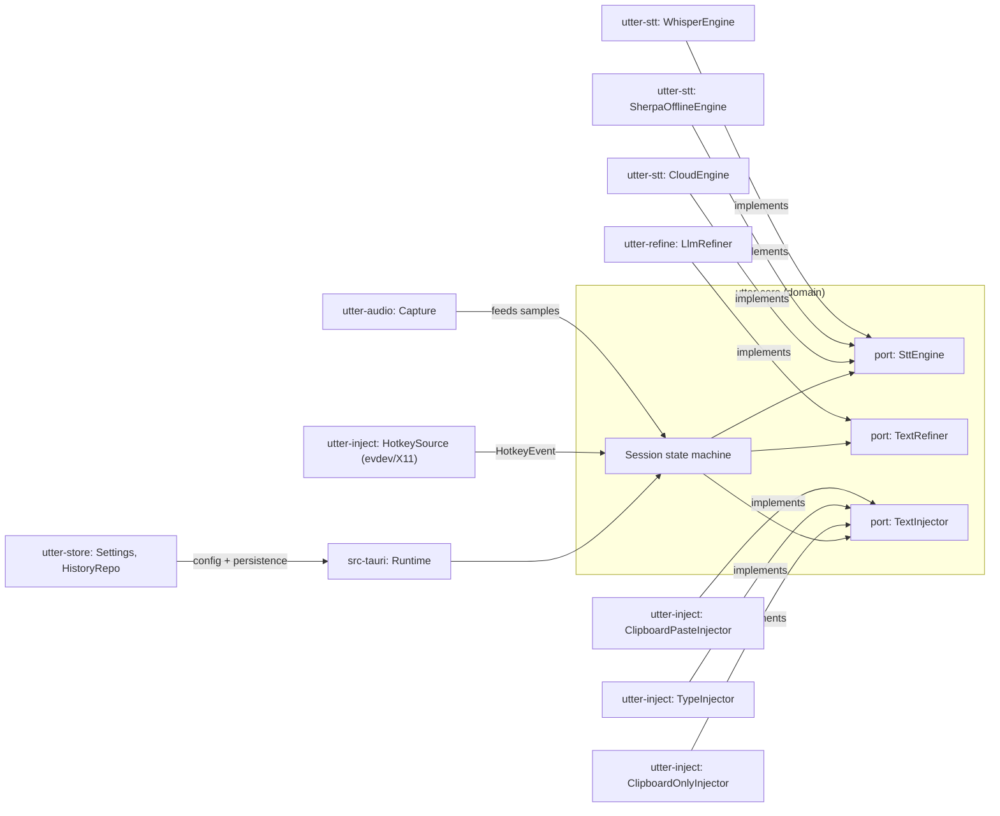
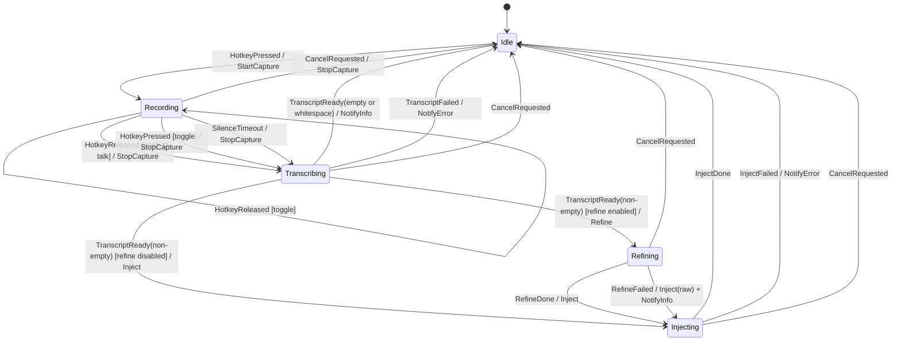

# Architecture

Utter is a Cargo workspace organized around a hexagonal (ports & adapters)
core: `utter-core` defines the domain — a pure session state machine and the
trait boundaries every other crate implements or calls — and depends on
nothing platform-, network-, or UI-specific. Everything else is an adapter
plugged in at the edge.

## Workspace map

| Crate | Responsibility |
|---|---|
| `utter-core` | Domain: the `Session` state machine, ports (`SttEngine`, `TextRefiner`, `TextInjector`), and shared types (`Transcript`, `Tone`, `InjectionMethod`). No I/O. |
| `utter-audio` | Microphone capture via `cpal`, resampling to 16 kHz mono `i16` (`rubato`), RMS level and silence detection. |
| `utter-stt` | Speech-to-text adapters behind Cargo features: `whisper` (whisper.cpp via `whisper-rs`), `sherpa` (offline sherpa-onnx transducer via the `sherpa-onnx` crate), `cloud` (any OpenAI-compatible `/audio/transcriptions` endpoint). |
| `utter-refine` | Transcript post-processing: dictionary replacement rules, snippet matching, prompt construction, and the LLM client (any OpenAI-compatible `/chat/completions` endpoint). |
| `utter-inject` | Global hotkey capture (evdev, with an X11 `global-hotkey` fallback) and text injection backends (clipboard-paste, direct typing, clipboard-only), chained with automatic fallback. |
| `utter-store` | TOML settings persistence, the SQLite-backed history repository, and the STT model catalog/downloader. |
| `apps/desktop/src-tauri` | Tauri 2 shell: boots the runtime from settings, wires adapters together on a worker thread, exposes commands/events to the UI, tray, and windows. |
| `apps/desktop/ui` | Svelte 5 + TypeScript settings UI and HUD: onboarding, engine/model management, dictionary, snippets, history. |

## Ports and adapters

## Session state machine

`Session::handle` (in `crates/utter-core/src/session.rs`) is a pure,
synchronous `fn(Event) -> Vec<Effect>`: it owns no I/O and is exhaustively
unit-tested. The diagram below reflects its transition table exactly;
event/effect pairs not shown are no-ops (state unchanged, no effects) —
notably, a `HotkeyPressed` while `Transcribing`, `Refining`, or `Injecting`
is ignored, since a new session cannot start until the current one reaches
`Idle`.

A streaming engine can additionally surface partial transcripts while in
`Recording` through `SttEngine::feed`'s `Option<String>` return, handled
outside the state machine by the runtime orchestrator
(`apps/desktop/src-tauri/src/runtime.rs`), which forwards them straight to
the HUD without affecting `Session`'s state. Neither current engine uses
this seam — whisper.cpp and sherpa-onnx are both batch, producing text only
at `finish()` — it exists for a future streaming engine.

## Data flow

1. **Hotkey** — the evdev (or X11 fallback) `HotkeySource` runs on its own
   thread, parses the configured chord, and sends `HotkeyEvent::Pressed` /
   `Released` over a channel the runtime worker selects on.
2. **Capture** — `Session::handle` turns a press into `Effect::StartCapture`;
   the runtime starts `utter-audio`'s `Capture`, which pulls frames from
   `cpal` and resamples them to 16 kHz mono `i16`.
3. **Engine feed** — each audio frame is fed to the active `SttEngine`. Both
   current engines (whisper.cpp, sherpa-onnx) buffer until `finish()`; a
   streaming engine could instead return partial text as it goes.
4. **Finish** — releasing the hotkey (or a silence timeout) stops capture
   and calls `engine.finish()`, producing a `Transcript`.
5. **Rules and snippets** — the runtime applies dictionary replacement rules
   to the raw transcript, then checks it against configured snippets. A
   snippet match replaces the text outright and skips the refiner
   entirely, regardless of the refine setting.
6. **Refine** — if refinement is enabled and no snippet matched,
   `Effect::Refine` calls the configured `TextRefiner` (`LlmRefiner`, backed
   by any OpenAI-compatible `/chat/completions` endpoint) with a bounded
   timeout. A failure or timeout falls back to the raw transcript and
   surfaces a non-blocking notice — the dictation is never lost.
7. **Inject** — the resulting text goes to the injector chain: clipboard-paste
   first, then direct typing, then clipboard-only, stopping at whichever
   succeeds.
8. **History** — on success, the runtime records the raw and final text,
   duration, engine, and best-effort target app in the SQLite history
   database (skipped entirely if history is disabled in settings). Audio
   itself is discarded once transcription finishes; it is never written to
   disk at any step above.

## Key decisions

- **evdev hotkeys over a desktop-portal API** — Wayland has no standard
  global-hotkey protocol, and hold-to-record needs modifier-only chords
  (e.g. `Ctrl+Super`) that compositor shortcut APIs generally don't expose.
  Reading `/dev/input` directly works uniformly across compositors, at the
  cost of needing `input` group / uinput permissions — which onboarding
  detects and offers a one-line fix for.
- **Clipboard-paste as the default injection method** — it's the fastest
  path that works reliably across GTK, Qt, Electron, and terminal apps
  alike, at the cost of touching the system clipboard (mitigated by saving
  and restoring its previous contents around the paste). The paste
  keystroke itself is synthesized through Utter's own `/dev/uinput` virtual
  keyboard device on both X11 and Wayland (no `ydotool` daemon required) —
  the same mechanism that lets synthetic input reach an arbitrary focused
  window under Wayland compositors also covers X11, so there is no separate
  XTEST path. The X11-specific code in `utter-inject` (`hotkey_x11`) is a
  hotkey-*listening* fallback only, not part of injection. Direct typing and
  clipboard-only are kept as fallbacks for the apps where paste is
  unreliable or clipboard access is undesirable.
- **Blocking `reqwest` on dedicated worker threads, no async runtime in the
  domain** — `utter-core` stays synchronous and deterministic (a pure state
  machine is easy to test exhaustively; an async one is not), so network
  calls (cloud STT, LLM refinement) use `reqwest`'s blocking client from the
  runtime's own worker thread rather than pulling `tokio` into the domain
  or adapter crates.
- **One trait for both batch and streaming engines** — `SttEngine::feed`
  returns `Option<String>` rather than `()` so a batch engine (whisper.cpp,
  sherpa-onnx — both only produce a result at `finish()`) and a future
  streaming engine can share one trait, without forcing a batch engine to
  fake partial output or a streaming one to discard its main advantage.
- **TOML settings, SQLite history** — settings are small, human-editable,
  and benefit from being diffable and hand-fixable (TOML); history is an
  append-heavy, queryable log where a real database (SQLite via `rusqlite`,
  bundled — no system dependency) is a better fit than a flat file.
- **Degradation over failure** — a missing model, an unset refine API key,
  an invalid hotkey, or a build without the `sherpa` feature all boot the app
  anyway, with the affected feature reporting an error only when actually
  used (or an upfront notice), rather than the whole app refusing to start.
  Runtime boot (`apps/desktop/src-tauri/src/runtime_boot.rs`) formalizes
  this as its explicit policy.
